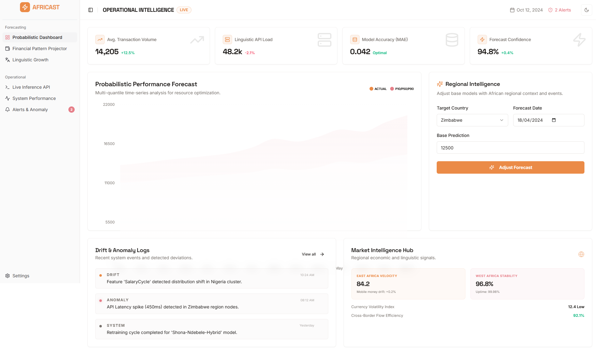
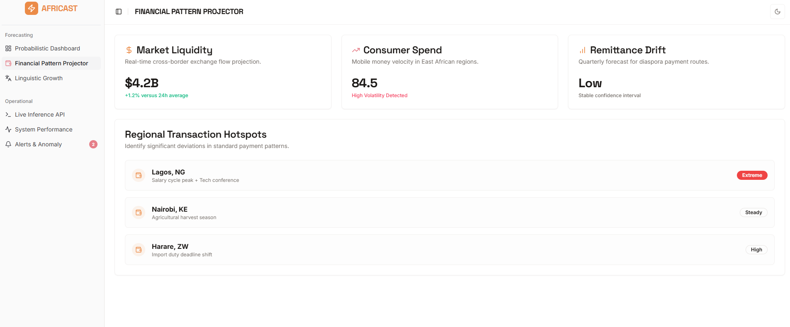

# Africast: Advanced African Market Intelligence

Africast is a professional intelligence platform providing probabilistic time-series forecasting and linguistic analysis specifically tailored for African markets. Built with a focus on regional context, it enables data-driven decision-making across financial and cultural landscapes.

## Live Demo
[https://africast-gamma.vercel.app/](https://africast-gamma.vercel.app/)

---

## Operational Intelligence
*Real-time monitoring of transaction volumes, linguistic API load, and continental system health.*


## Financial Pattern Projector
*Visualizing mobile money velocity, market liquidity, and regional hotspots across Lagos, Nairobi, and Harare.*


---

## Key Features

- **Financial Pattern Projector**: Real-time monitoring of mobile money velocity and liquidity drift. Identify significant activity hotspots in major economic hubs.
- **Probabilistic Forecasting**: Advanced multi-quantile time-series analysis (P10/P50/P90) for transaction volumes, allowing for risk-aware resource optimization.
- **Regional Intelligence Adjuster**: An intelligent engine that adjusts base forecasts by identifying regional events like public holidays and mobile network outages.
- **Linguistic Growth Analytics**: Predicts usage trends and frequency shifts for African languages (e.g., Shona, Ndebele, Swahili) to aid in localization and resource allocation.
- **Operational Intelligence Hub**: Live monitoring of inference API performance, global latency, and probabilistic drift detection alerts.
- **Platform Navigator Assistant**: A conversational guide designed to help users discover features and navigate the platform efficiently.

---

## Architecture

Africast leverages a modern, server-centric architecture designed for high performance and scalability:

- **Frontend**: Next.js 15 App Router with Server Components for optimized rendering and SEO.
- **Intelligence Engine**: Genkit integration for managing complex reasoning, prompts, and tool-calling logic.
- **Data Visualization**: Recharts for responsive, probabilistic data visualizations and uncertainty intervals.
- **Styling**: Tailwind CSS with a custom HSL-based theme supporting light and dark modes.
- **UI Components**: Radix UI primitives via Shadcn for accessible and professional-grade interfaces.

---

## Tech Stack

- **Framework**: Next.js 15 (React 19)
- **AI/LLM Logic**: Genkit + Google Gemini
- **Styling**: Tailwind CSS
- **Visualization**: Recharts
- **Icons**: Lucide React
- **Typography**: Space Grotesk (Headlines) & Inter (Body)

---

## Setup & Local Development

### Prerequisites
- Node.js 20 or higher
- A Google Gemini API Key

### Installation

1. **Clone the repository**
2. **Install dependencies**:
   ```bash
   npm install
   ```
3. **Configure Environment Variables**:
   Create a `.env` file in the root directory:
   ```env
   GOOGLE_GENAI_API_KEY=your_gemini_api_key_here
   ```
4. **Run the development server**:
   ```bash
   npm run dev
   ```

---

## Deployment

The project is optimized for deployment on **Firebase App Hosting** or **Vercel**, providing seamless scaling for Next.js applications.

1. Connect your GitHub repository to your hosting provider.
2. Configure your `GOOGLE_GENAI_API_KEY` in the environment secrets.
3. Every push to the main branch will trigger an automated build and deployment.

---
Built for the future of African digital infrastructure.